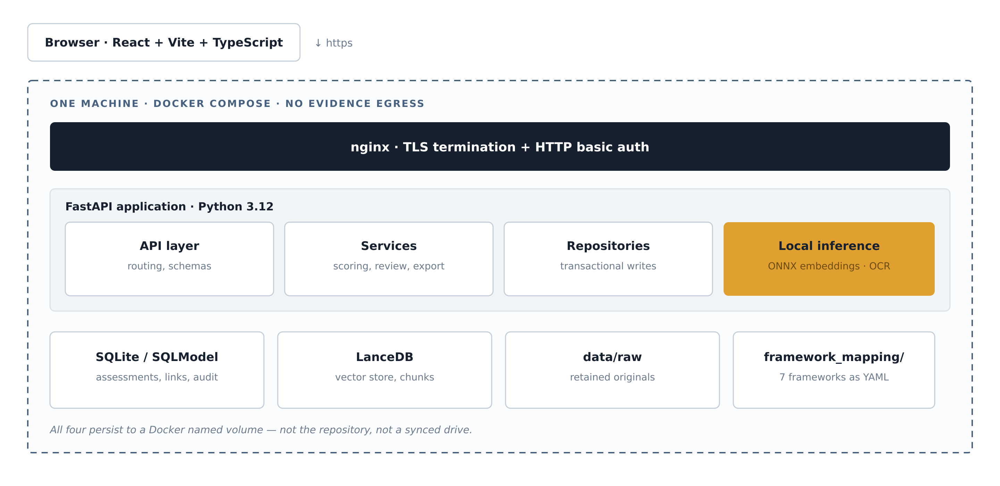
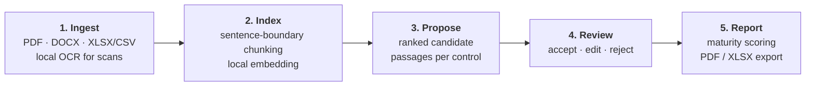

# AI-Augmented Compliance Assessment Platform

A local-first platform that accelerates energy-sector cybersecurity compliance assessment. Upload
your policy and evidence documents, and it retrieves the passages that support each control
requirement, tracks a human review decision on every one, scores maturity, and produces an
audit-ready report — without any document ever leaving the machine it was uploaded to.

Built around seven frameworks: **C2M2**, **NIST CSF** (1.1 and 2.0), **NERC CIP**, **CIS Controls
v8**, **ISO 27001**, **SOC 2**, and **PCI DSS**.

---

## What this is, and what it is not

**It is** a retrieval and review workbench. It finds candidate evidence, ranks it, shows you the
exact source passage, and records your decision.

**It is not** a generative system. There is no LLM in the pipeline, and this is a permanent
architectural decision rather than a gap awaiting a future release — see
[`ADR-0020`](docs/adr/ADR-0020-mvp-closure-retrieval-only.md) and `ADR-0036`.

Chat over your evidence returns the **literal, already-reviewed passage**, quoted verbatim. It never
writes an answer. The tradeoff is deliberate: a tool that only quotes cannot fabricate a citation,
and an assessor signing their name to a finding can verify it against the source page rather than
against a paraphrase.

Nothing an AI proposes affects a score until a person accepts it.

---

## Quick start

**Prerequisites:** Docker Desktop (running) and Git. On Windows, use Git Bash and enable
Docker Desktop → Settings → Resources → WSL Integration. WSL2 must be installed
(`wsl --install` in an admin PowerShell) and the machine restarted before Docker will start.

```bash
git clone https://github.com/fraz7900/ai-augmented-assessment-framework.git
cd ai-augmented-assessment-framework/deployment
```

### 1. Create credentials

nginx refuses to start without these. That is deliberate fail-closed behaviour, not a bug.

```bash
mkdir -p secrets

read -s -p "Choose a password: " PW; echo
docker run --rm httpd:alpine htpasswd -Bbn <your-username> "$PW" > secrets/.htpasswd
unset PW

docker run --rm -v "$PWD/secrets:/secrets" alpine/openssl req -x509 -nodes \
  -newkey rsa:2048 -days 825 -keyout /secrets/tls.key -out /secrets/tls.crt \
  -subj "/CN=localhost" -addext "subjectAltName=DNS:localhost,IP:127.0.0.1"
```

> **On Windows Git Bash**, prefix both `docker run` commands with `MSYS_NO_PATHCONV=1`. Without it,
> Git Bash rewrites `/CN=localhost` into a Windows path and openssl rejects it.

`secrets/` is gitignored. Never commit it.

### 2. Start

```bash
docker compose up -d --build     # first build takes 5–10 min
docker compose ps                # wait for backend = healthy
```

Open **https://localhost:5173** and accept the self-signed certificate warning.

> **Do not publish port 5173 to a network.** The certificate is self-signed and HTTP basic auth is
> the only access control. This stack is designed for single-user or small-team use on a trusted
> machine.

### 3. Walk through it

Sample documents are in [`data/sample_evidence/`](data/sample_evidence/).

1. Upload a document.
2. Create an assessment against C2M2 or NIST CSF 2.0.
3. Link the document to a real practice ID — `ACCESS-1a` for C2M2, `PR.AA-01` for NIST CSF 2.0.
4. Click **Propose AI mappings**, then accept, edit, or reject each candidate.
5. Open the **Dashboard** and download the PDF or XLSX report.
6. Ask **Chat** a question. Only accepted or edited evidence with a cited chunk is answerable.

The API browser is at `/docs` — some capabilities (organisation endpoints, framework version
selection) are reachable there but not yet exposed in the UI.

### 4. Shut down

```bash
docker compose down       # keeps your data
docker compose down -v    # destroys the volume, including uploaded documents
```

---

## Architecture

<p align="center">
  
</p>

Three properties worth calling out:

- **Layering is enforced.** `services/` depends on `repositories/` and `ai/` as interfaces, and
  `api/` depends on `services/`. Business logic is testable without a running server or a live model.
- **Local inference sits inside the boundary.** Embeddings run against an ONNX model on disk
  (`fastembed` / `BAAI/bge-small-en-v1.5`, no PyTorch). OCR bundles its own ONNX weights inside the
  installed Python package, so nothing is fetched at runtime. There is no code path from evidence
  content to a network call.
- **Frameworks are versioned data, not code.** Adding one is a YAML file, not a release.

All persistent state lives in a Docker named volume — not the repository, and not a synced drive.

### How evidence flows through



Step 4 is not a formality. Every evidence link carries a status, and only `ACCEPTED` or `EDITED`
links can support a positive finding. `PENDING` and `REJECTED` contribute nothing — counting
`PENDING` would auto-accept an AI proposal by the back door. This is enforced in the service layer,
because the frontend is not an integrity boundary.

---

## Framework coverage

Transcription scope is set by each standard's licence, checked before any code was written. "Free to
download" and "licensed for reproduction" are different questions, and only the second one
determines how much could be encoded.

| Framework | Encoded | Scope | Licence position |
|---|---|---|---|
| C2M2 v2.1 | 356 / 356 practices | Full text | Public domain (DOE) |
| PCI DSS v4.0.1 | 249 leaf requirements | Statements only | Free download, all rights reserved |
| CIS Controls v8 | 153 / 153 safeguards | Full text | Creative Commons BY-NC-ND |
| NERC CIP | 141 / 141 requirement parts | Full text | Public source, 13 mandatory standards |
| NIST CSF 1.1 | 108 subcategories | Full text | Public domain |
| NIST CSF 2.0 | 106 subcategories | Full text | Public domain |
| ISO 27001:2022 | 93 / 93 Annex A titles | **Titles only** | Paid publication (~$600) |
| SOC 2 (TSC) | 61 / 61 criteria | Statements only | Free download, all rights reserved |

Each count was verified against the source document's own asserted total rather than assumed
complete. Reconstructing a paid standard's text from model memory was rejected outright.

**Cross-framework equivalence:** 715 reviewed entries across six pairings. Candidates are generated
by embedding similarity, then confirmed or rejected by a person — equivalence is never inferred from
a score alone. The NIST CSF 1.1 → 2.0 mapping is the exception, transcribed from NIST's own
published crosswalk, which is stronger provenance than internal judgment.

---

## Repository layout

```
backend/            FastAPI application (src-layout: backend/src/compliance_platform)
  ├── api/          Route handlers and request/response schemas
  ├── services/     Business logic — scoring, review, export, chat
  ├── repositories/ Transactional data access
  ├── ai/           Embedding and retrieval interfaces
  └── models/       SQLModel entities and Pydantic schemas
frontend/           Vite + React + TypeScript; API types generated from the OpenAPI schema
framework_mapping/  Framework definitions and cross-framework equivalence, as YAML
deployment/         Docker Compose stack, nginx config, TLS/auth secrets
data/               Synthetic sample evidence only — never real documents
docs/               Charter, ADRs, product docs, architecture notes
scripts/            Backup, generation, and maintenance utilities
tests/              Test suite
```

---

## Development

Docker is the recommended path for anything involving real documents, because local development mode
writes uploads and the vector store into `data/` inside your working copy. Use local development for
synthetic samples and for writing code.

**Backend**

```bash
cd backend
python3.12 -m venv .venv && source .venv/bin/activate
pip install -e ".[dev]"
uvicorn compliance_platform.main:app --reload
```

**Frontend**

```bash
cd frontend
npm ci --legacy-peer-deps    # the flag is required — known TypeScript peer conflict
npm run dev
```

Then open `http://localhost:5173`.

**Tests and checks**

```bash
cd backend && pytest -q && ruff check .    # 811 tests
cd frontend && npm test && npm run build   # 146 tests; build runs tsc -b
```

CI runs both on every push, against hash-pinned dependencies — the backend lockfile records a
SHA-256 per package, so a measurement taken today is reproducible tomorrow. If the local frontend
runner drops a file, re-run it; CI is the authority on the real count.

---

## Design decisions worth knowing

The full record is in [`docs/adr/`](docs/adr/) (84 entries). [`ADR-0084`](docs/adr/ADR-0084-what-is-deliberately-not-done.md)
consolidates what is deliberately *not* done. The decisions that shape day-to-day behaviour:

| Decision | Why it matters |
|---|---|
| **Retrieval-only architecture** | No LLM. Evaluated four separate times and closed rather than deferred. |
| **Not assessed ≠ non-compliant** | A practice with no evidence and one confirmed as a gap once scored identically. They are now reported separately. |
| **Credit requires linked evidence** | A satisfied finding with zero evidence links used to raise maturity. A free-text rationale alone no longer can. |
| **Finalization readiness gate** | An assessment cannot be frozen as an audit record while AI proposals are unreviewed. Enforced in the service, returned as a 409. |
| **Pinned framework versions** | Each assessment records the framework version it was scored against, so a later YAML correction cannot retroactively change a finalized result. |
| **Tamper-evident audit seal** | A sealed assessment reports alteration rather than passing silently. A seal read by an older build reports `unverifiable`, never a false `altered`. |
| **Organisational data boundary** | Assessments and documents belong to an organisation, enforced inside the write transaction — including in vector retrieval. |
| **Export currency** | Every export prints a digest of the figures behind it, and an endpoint answers whether that export is still current. |
| **Hash-pinned dependencies** | CI once resolved packages fresh on every run, so every published measurement was taken against an unrecorded environment. Now pinned per package. |

---

## Known limitations

Stated here rather than left to be discovered:

- **No authentication or RBAC.** The requester's identity is a username asserted by the reverse
  proxy. The organisation boundary is a *data* boundary, not multi-tenancy — anything reaching the
  API directly can still cross it. Single machine, trusted operator, never network-exposed.
- **OCR text is approximate.** Provenance is now resolved per passage and carried into the PDF and
  XLSX exports — including an explicit "cannot say" value, because that is a real answer — but the
  underlying text is still an approximation of a scan.
- **Retrieval precision is low, and structurally so.** Measured at ~0.012 and shown not to be a
  small-corpus artifact: across 5 → 505 documents precision held (0.0117 → 0.0113) while the
  proposal count saturated at 355 — every uncovered C2M2 practice. Human review is what stands
  between the platform's traceable conclusions and its inaccurate retrieval, which is exactly why no
  AI proposal can reach a score without a person accepting it. **No test in this repository fails
  because of this**, so a green suite does not speak to it.
- **Copyright-limited coverage.** ISO 27001, SOC 2 and PCI DSS carry less text than the rest, and
  equivalence judged against titles alone is weaker than full-text comparison.
- **Scores can change retroactively.** A correctness fix can lower a number already given to a
  stakeholder, and the platform cannot notify anyone that it moved.
- **Backups are manual.** Archives are verified rather than merely checksummed — a digest proves the
  bytes, not that the database inside opens — but there is still no schedule, rotation, or
  off-machine copy.
- **Upload retention is not retroactive.** Documents ingested before original-file retention was
  added cannot be re-ingested.
- **Review-agreement data is empty.** The `/aqs/agreement` endpoint exists to turn real reviewer
  decisions into a measurable agreement rate. Nothing has fed it yet.

---

## Data and privacy

All evidence in this repository is public framework documentation or synthetic sample material. No
real client or employer data is used at any point — see
[`data/sample_evidence/README.md`](data/sample_evidence/README.md).

The software keeps documents on your machine. It does **not** establish that you are permitted to put
a given document into it. Organisational policy, client NDAs, and programme rules are separate
questions belonging to whoever owns the documents. For testing with genuinely realistic input
without that question, use public material: a published regulation, a utility's posted security
policy, a public university's IT standards.

For handling rules when testing against real documents, see
[`docs/testing-with-real-documents.md`](docs/testing-with-real-documents.md).

---

## Documentation

**Start with [`docs/project-status.md`](docs/project-status.md)** — the full current snapshot, kept
current rather than written once. It is the right entry point for a stakeholder briefing.

| Document | What it covers |
|---|---|
| [`docs/project-status.md`](docs/project-status.md) | Current snapshot: what the application does, and every disclosed limitation |
| [`PROJECT_CHARTER.md`](PROJECT_CHARTER.md) | Business problem, stakeholders, success metrics, scope |
| [`docs/adr/`](docs/adr/) | Architecture Decision Records, including decisions *not* to build |
| [`docs/testing-guide.md`](docs/testing-guide.md) | How to test every critical fix by hand — and what a green suite still does not prove |
| [`docs/current_sprint.md`](docs/current_sprint.md) | Milestone tracker: done versus in progress |
| [`docs/architecture/`](docs/architecture/) | Repository layout and rationale |
| [`docs/product/`](docs/product/) | PRD, personas, requirements, risk register, backlog |
| [`docs/consulting/`](docs/consulting/) | Executive summaries and business value / risk assessments |
| [`deployment/README.md`](deployment/README.md) | Deployment stack detail |

---

## Technology

Python 3.12 · FastAPI · SQLModel / SQLite · LanceDB · fastembed (ONNX, `BAAI/bge-small-en-v1.5`) ·
pypdfium2 + rapidocr for local OCR · fpdf2 and openpyxl for report export · React · Vite ·
TypeScript · TanStack Query · Tailwind CSS · Docker Compose · nginx · GitHub Actions
